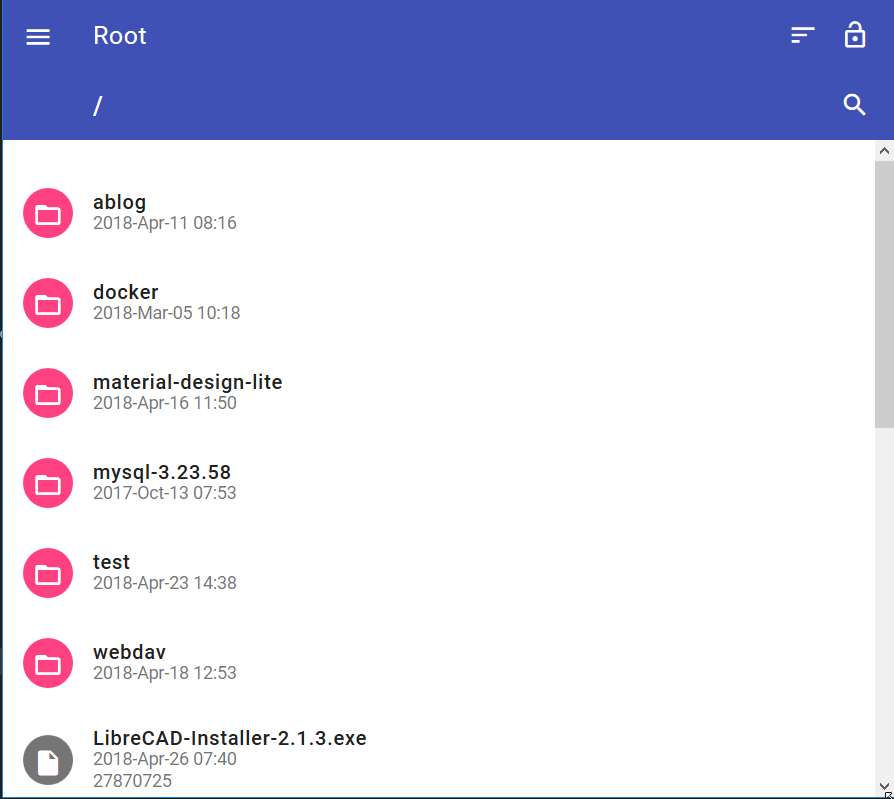
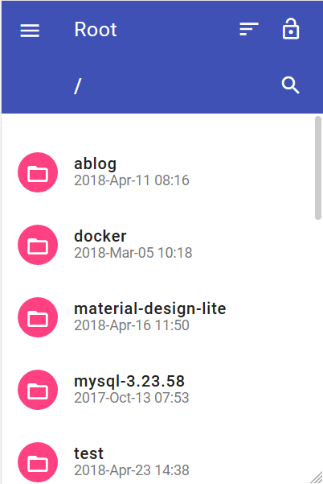

# Nginx-Fancyindex-Theme

Theme "design material" for nginx-fancyindex module





use icon from https://feathericons.com/

## Installation

The fancyindex module can be found [here](https://github.com/aperezdc/ngx-fancyindex) (by @aperezdc).

On debian

    apt-get install git nginx-extras

sample of configuration of nginx

```bash
server {
    listen 80 default_server;
    client_max_body_size 1G;
    
    location / {
        root /<path_nginx_root>;
        fancyindex on;
        fancyindex_localtime on;
        fancyindex_name_length 255; # Maximum file name length in bytes, change as you like.
        # theme
        fancyindex_header "/fancyindex/header.html";
        fancyindex_footer "/fancyindex/footer.html";
        fancyindex_ignore "fancyindex";

        auth_basic  "Access restricted";
        auth_basic_user_file /etc/nginx/.htpasswd;
    }

}
```

you can clone project an copy file in your root path nginx

    git clone https://github.com/fraoustin/Nginx-Fancyindex-Theme.git
    mkdir /<path_nginx_root>/fancyindex
    cd Nginx-Fancyindex-Theme
    cp -R * /<path_nginx_root>/fancyindex

you can change color of interface

    cd /<path_nginx_root>/fancyindex/mdl
    rm material.min.css 
    cp color/<your-color>.min.css material.min.css


## TODO

optimize code

## THANK YOU

- [ViRb3](https://github.com/ViRb3)
- [amagri](https://github.com/amagri)

